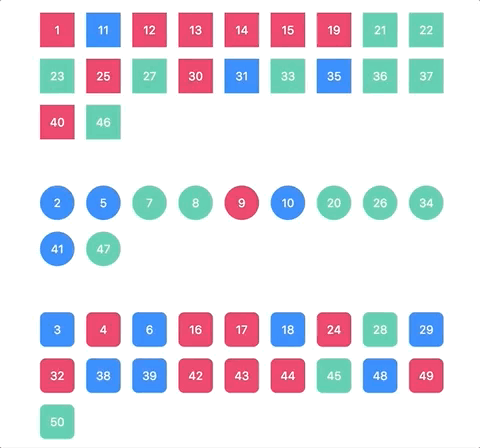
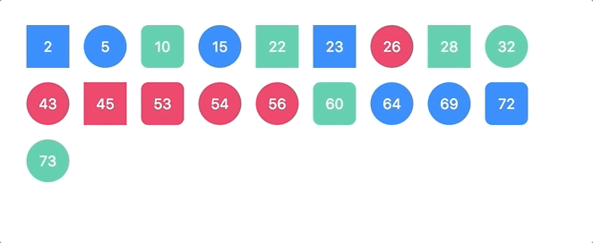

# Building animations in React from scratch

## 1. Basic sequenced enter & exit

- [Live example](http://alex.holachek.com/react-animations-from-scratch/?selectedKind=Animation%20Examples&selectedStory=1.%20The%20basic%20technique&full=0&down=1&left=1&panelRight=0)
- [Code](./src/examples/BasicEnterExitExample)

## 2. Grouping items

- [Live example](http://alex.holachek.com/react-animations-from-scratch/?selectedKind=Animation%20Examples&selectedStory=2.%20Object%20persistence&full=0&down=1&left=1&panelRight=0)
- [Code](./src/examples/GroupItemsExample)

## 3. Enter/update/exit

- [Live example](http://alex.holachek.com/react-animations-from-scratch/?selectedKind=Animation%20Examples&selectedStory=3.%20Enter%2C%20update%20and%20delete%20transitions&full=0&down=1&left=1&panelRight=0)
- [Code](./src/examples/ArrayUpdateExample)
